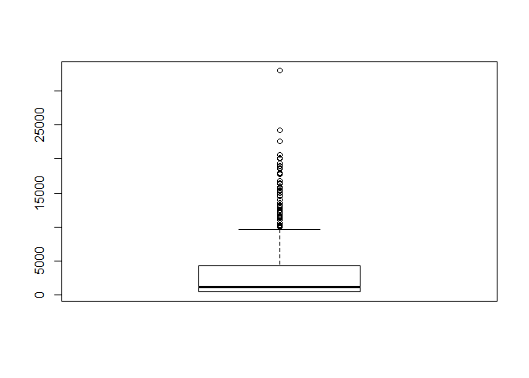

# USU STAT 2300 Module 1
Camille Fairbourn  
#Module 1

[Link to RStudio Introduction video](https://drive.google.com/file/d/0B57yktAdJPDkOEw2WHNCTWpsclU/view?usp=sharing)

###Lesson C, Page 4

Load the packages into working memory. You must do this each time you use RStudio.

```r
require(MASS)
require(mosaic)
require(openintro)
```

####Using R as a calculator

It's possible to use R as a calculator, although that is a bit of overkill.

Suppose we have 6 exam scores and we wish to find the average.

Using algebraic commands:

```r
(78+73+92+85+75+98)/6
```

```
## [1] 83.5
```

####Using basic statistical functions in R

We can use R commands to accomplish the same task. First we form a vector or list in R of the scores. We do this using the combine, `c()`, function. Then we wrap this inside the `mean()` function, which calculates the average.


```r
mean(c(78,73,92,85,75,98))
```

```
## [1] 83.5
```

Similarly, we can use the R function `sd()` to calculate the sample standard deviation of the exam scores.


```r
sd(c(78,73,92,85,75,98))
```

```
## [1] 9.974969
```

####Saving a list of numbers

In the case where you want to use the same list or vector repeatedly, it's a good idea to give it a descriptive name. In this case, we'll name our vector "exams". Use the assignment operator <- to do this.


```r
exams <- c(78,73,92,85,75,98)
```

Now, we can use the R function `var()` to calculate the variance of the exam scores, using the name of the vector instead of typing out the values again.


```r
var(exams)
```

```
## [1] 99.5
```

####Using the favstats function

In the mosaic package, there is a function called `favstats()`, which wil calculate several statistics at once. You must have the mosaic package installed *and* loaded for this function to work.


```r
favstats(exams)
```

```
##  min    Q1 median    Q3 max mean       sd n missing
##   73 75.75   81.5 90.25  98 83.5 9.974969 6       0
```

Notice that the mean and sd are the same as we calculated up above.

***

####Looking at a pre-loaded data set

Many of the packages used in R include sample data sets. When you load the openintro package, you gain access to this data. We'll use the `View()` function to look at salary data for Major League Baseball players in 2010. Notice that there is a capital "V" for this command. Punctuation matters! The command below will open the dataset in a new tab RStudio.


```r
View(MLB)
```

You'll want to pay attention to how the data is labeled and coded. Specifically, note the names of the variables and how they are spelled.

####Creating a bar chart

Suppose we want to create a visual representation of the number of players who play each position on a baseball team. This is a nominal variable, so we want to create a bar chart.  We can do this using the `barchart()` function.


```r
barchart(MLB$position)
```

<!-- -->

Often, we want to modify the chart to include a title, axis labels, and other elements that make the chart more visually appealing and informative. We can add arguments to the barchart function to accomplish this. The comments in the code below tell you which part of the function call does what.


```r
barchart(MLB$position, # We list the dataset first, followed by $ and then the name of the variable
         horizontal = FALSE, # This tells R to draw the bars vertically
         main = "Position",  # This will label the chart. Put your title in quotation marks.
         ylab = "Count", # This will label the y-axis.
         scales = list(x = list(rot = 45)), # This rotates the labels on the x-axis to make them easier to read.
         col = "skyblue3") # This specifies the color of the fill on the bars.
```

<!-- -->

The MLB data set includes the salary for each player. Salary is an interval variable, so we can use the `favstats()` function to calculate statistics. Notice the notation: MLB$salary tells R to look in the data set MLB for the variable salary.


```r
favstats(MLB$salary)
```

```
##  min      Q1  median   Q3   max     mean       sd   n missing
##  400 418.315 1093.75 4250 33000 3281.828 4465.449 828       0
```

####Creating a histogram

To create a visual representation of an interval variable, we use a histogram. The R function `hist()` does this. 


```r
hist(MLB$salary)
```

<!-- -->

As with the barchart, we want to modify the basic `hist()` function to add or change features of the plot Again, pay attention to the comments in the code below to understand what each additional argument does.


```r
hist(MLB$salary, # The first argument tells R which variable to graph
     col = "skyblue3", # This specifies the color of the bars
     main = "MLB Salaries", # This creates the title for the chart
     xlab = "Salary (in $1000s)") # This labels the x-axis
```

<!-- -->

####Create a boxplot
[Link to video demonstration](https://drive.google.com/file/d/0B57yktAdJPDkMEoza1FKdy1McnM/view?usp=sharing)

We can use the R function `boxplot()` to create a boxplot of the salary variable in the MLB data set.


```r
boxplot(MLB$salary)
```

<!-- -->

Like with the barchart and histogram functions, we can modify the command to create titles and change the orientation.


```r
boxplot(MLB$salary, # Specify the variable to graph
        horizontal = TRUE, # Change the orientation of the plot
        main = "MLB Salaries") # Create a title for the plot
```

<!-- -->

####Side-by-side boxplots

We often want to compare the numerical results of an interval variable based on the classification of a nominal variable. Side-by-side boxplots allow us to do this easily. Using the `boxplot()` command, we name the interval variable first, then connect it to a nominal variable using the tilde '~'. You must then specify the data set as an additional argument to the function.


```r
boxplot(salary~position, # Specify the variables to graph
        data = MLB, # Specify the data set that contains the variables
        las = 2, # Forces the axis labels to be perpendicular to the axes
        cex.axis = 0.6) # Make the text of the axis labels smaller
```

<!-- -->

This plot has a lot of variables. We can use a data set from the MASS package to look at a simpler example. The data set Sitka contains repeated measurements on the log-size of 79 Stika spruce trees, 54 of which were grown in ozone-enriched chambers and 25 were controls. The size was measured five times in 1988, at roughly monthly intervals. Here we use "size" as the interval variable, and "treat" as the nominal variable.


```r
boxplot(size~treat, data = Sitka)
```

<!-- -->

This plot shows us that the trees were roughly the same size, although trees in the control group tended to be slightly larger than trees in the ozone group. We can tell this because the middle 50% of the control group (contained in the "box") is slightly above the middle 50% of the ozone group.
