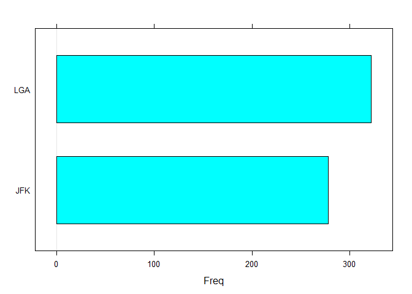
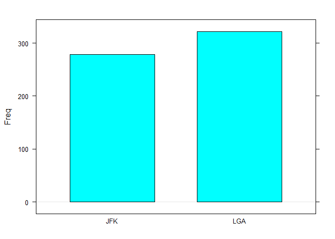
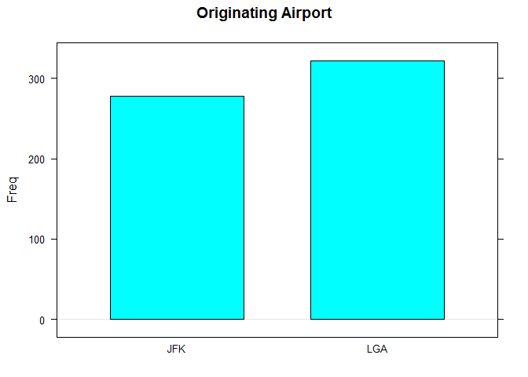
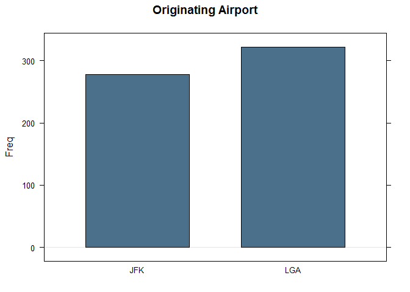
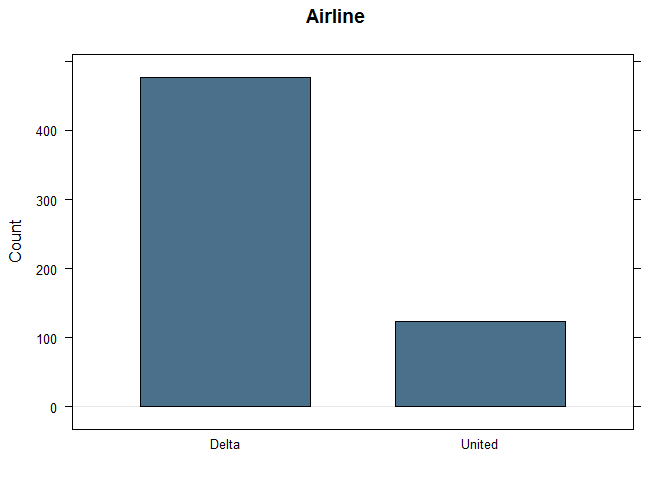

# Camille's R Book
Camille Fairbourn  
#Module 2 Probability

As mentioned previously, each time you open a new RStudio session, you need to run the following three commands.


```r
require(mosaic)
require(openintro)
require(MASS)
```

In Module 2 we talk about nominal variables and create contingency tables to organize the counts of two different nominal variables.

First, we'll read in the Youngprof dataset.

```r
Youngprof<-read.csv("http://www.math.usu.edu/cfairbourn/Stat2300/RStudioFiles/data/Youngprof.csv")
```

Use the View() function to look at the variables in the dataset. This data measures 8 different variables on a sample of 400 subscribers to a magazine. Four of these variables are nominal and four are interval.

```r
View(Youngprof)
```

We can easily create a barchart for each of the nominal variables: gender, realestate, broadband, and children.

Watch how the code and the chart change as we add arguments to the barchart() function.

####Basic barchart

```r
barchart(Youngprof$gender)
```

<!-- -->

####Barchart with vertical bars

```r
barchart(Youngprof$gender, # Specify the variable to graph
         horizontal=FALSE) # Change to vertical bars
```

<!-- -->

####Add a chart title

```r
barchart(Youngprof$gender, # Specify the variable to graph
         horizontal = FALSE, # Change to vertical bars
         main = "Gender of Respondents") # Add chart label
```

<!-- -->

####Change the color of the bars

```r
barchart(Youngprof$gender, # Specify the variable to graph
         horizontal = FALSE, # Change to vertical bars
         main = "Gender of Respondents", # Add chart label
         col = "skyblue4") #change bar color
```

<!-- -->

####Modify the y-axis label

```r
barchart(Youngprof$gender, # Specify the variable to graph
         horizontal = FALSE, # Change to vertical bars
         main = "Gender of Respondents", # Add chart label
         col = "skyblue4", #change bar color 
         ylab = "Count") #change vertical axis label
```

<!-- -->

####Make a barchart for Broadband

```r
barchart(Youngprof$broadband, horizontal=FALSE, 
         main="Broadband Access", col="skyblue4", ylab="Count")
```

<!-- -->

###Creating a contingency table
To create a contingency table, we use the xtabs() function. We need to specify which variables we want R to tabulate first, then indicate the data set. In the code below we create a contingency table for gender and broadband and store the result as contable.

```r
contable <- xtabs(~gender + broadband, data = Youngprof)
#Read the output from your table
contable
```

```
##         broadband
## gender    No Yes
##   Female  69 112
##   Male    85 144
```


