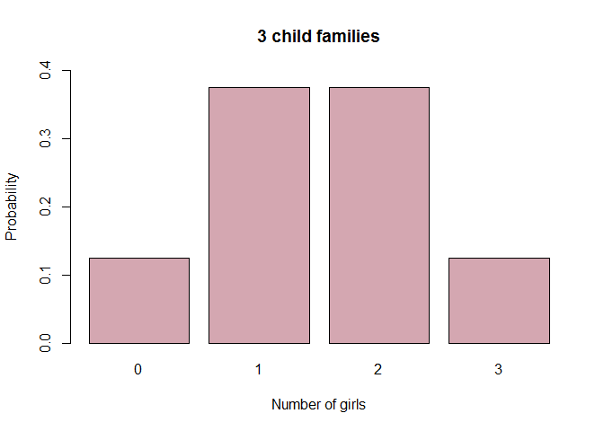
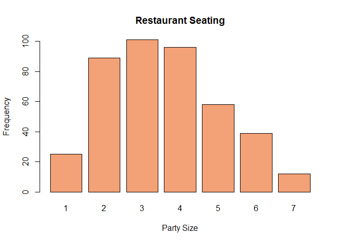
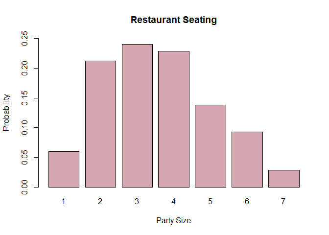
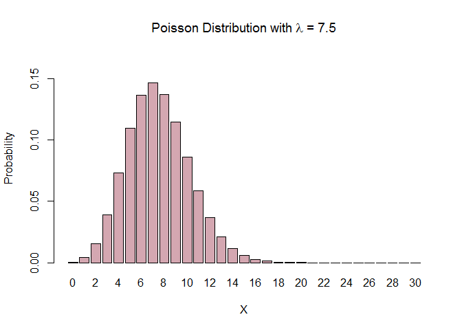

# Camille's R Book
Camille Fairbourn  
#Module 3 Discrete Random Variables

##Discrete Random Variables

As mentioned previously, each time you open a new RStudio session, you need to run the following three commands.


```r
require(mosaic)
require(openintro)
require(MASS)
```
####Creating a probability distribution from calculated theoretical probabilities

In the lectures we see a graph of the discrete random variable for X, the number of girls in a 3-child family

We'll use the combine function c() to create a vector of values for the random variable X and then use it again to create a vector for the probabilities.


```r
values<-c(0, 1, 2, 3)
probs<-c(1/8, 3/8, 3/8, 1/8)
```

Next, we'll use the barplot() function to create a barchart of the probability distribution


```r
barplot(probs, # Specify the vector describing the bars to plot
        names.arg = values, # Specify the vector of names to be plotted below each bar
        ylim = c(0,.4), # Specify the limits for the y-axis
        main = "3 child families", # Create a title for the chart
        ylab = "Probability", # Label the y-axis
        xlab = "Number of girls", #Label the x-axis
        col = "#D4A7B1") #Specify the color. Here I used a hexadecimal value.
```

<!-- -->

####Creating a probability distribution from observed frequencies

**Example: Restaurant Seating**

Again we use the combine function, c(), to create a vector of values for the random variable X, the number of people in a restaurant party. We'll also use it to create a vector of the observed frequency for each value of X.


```r
values <- c(1, 2, 3, 4, 5, 6, 7)
freq <- c(25, 89, 101, 96, 58, 39, 12)
```

To calculate the probabilities, we need to divide each frequency by the total. The function sum() will calculate the total for us.


```r
prob <- freq / sum(freq)
```

As above, we use the barplot() function to create the graph of the *frequencies*.


```r
barplot(freq, # Specify the vector describing the bars to plot
        names.arg = values, # Specify the vector of names to be plotted below each bar
        main = "Restaurant Seating", # Create a title for the chart
        ylab = "Frequency", # Label the y-axis
        xlab = "Party Size", #Label the x-axis
        col = "#F3A176") #Specify the color. Here I used a hexadecimal value.
```

<!-- -->

We can also use barplot() to create the probability graph.


```r
barplot(prob, # Specify the vector describing the bars to plot
        names.arg = values, # Specify the vector of names to be plotted below each bar
        ylim = c(0,.25), # Specify the limits for the y-axis
        main = "Restaurant Seating", # Create a title for the chart
        ylab = "Probability", # Label the y-axis
        xlab = "Party Size", #Label the x-axis
        col = "#D4A7B1") #Specify the color. Here I used a hexadecimal value.
```

<!-- -->

Notice that while the two graphs appear visually similar, in the one we are plotting frequencies and the other probabilities. This is reflected in the y-axis.

####Calculate the expected value, variance, and standard deviation of a discrete random variable

First use the combine function, c(), to enter the $x_i$ values for the random variable, and the observed frequencies for each $x_i$

```r
values <- c(1, 2, 3, 4, 5, 6, 7)
freq <- c(25, 89, 101, 96, 58, 39, 12)
```

Now calculate the probability $P(x_i)$ for each value.

```r
prob <- freq / sum(freq)
```

Calculate the sum of the product of $x_i$ and $P(x_i)$, 

$\sum x_{i}\cdot P(x_{i})$ 

and save this as ev.

```r
ev <- sum(values * prob)
ev
```

```
## [1] 3.566667
```

Next, we calculate the deviations from expected value for each $x_i$. Using mathematical notation, this is

$x_i - \mu_x$


```r
devs <- values - ev
```

And then square each deviation to get $(x_i - \mu_x)^2$.

```r
sqdevs <- (devs)^2
```

To get the variance, we multiply each deviation by the probability $P(x_i)$ and add them up.

$\sum (x_i - \mu_x)^2\cdot P(x_{i})$


```r
var <- sum(sqdevs * prob)
var
```

```
## [1] 2.202698
```

Then, to calculate the standard deviation we take the square root of the variance.

```r
stdev <- sqrt(var)
stdev
```

```
## [1] 1.484149
```

To finish off, create a table of the intermediate results we've calculated. The function cbind() combines the vectors we have created into a table.

```r
evvar <- cbind(values, freq, prob, devs, sqdevs)
evvar
```

```
##      values freq       prob       devs     sqdevs
## [1,]      1   25 0.05952381 -2.5666667  6.5877778
## [2,]      2   89 0.21190476 -1.5666667  2.4544444
## [3,]      3  101 0.24047619 -0.5666667  0.3211111
## [4,]      4   96 0.22857143  0.4333333  0.1877778
## [5,]      5   58 0.13809524  1.4333333  2.0544444
## [6,]      6   39 0.09285714  2.4333333  5.9211111
## [7,]      7   12 0.02857143  3.4333333 11.7877778
```

##Binomial Random Variables


To calculate individual values for the binomial distribution (equivalent to the binompdf funtion on the TI-84 calculator) we use the dbinom() function. The syntax is

dbinom(x, n, p)

which is a different order of the same numbers required for the calculator function.

As an example, let's assume we have a binomial random variable for a sample size of 12 and a fixed probability p = 0.12. Use dbinom() to find $P(x = 1)$.


```r
dbinom(1, 12, 0.12)
```

```
## [1] 0.3529164
```

Use your calculator to verify this result. Try some others on your own to get the hang of it.

There is also an R function that is equivalent to the binomcdf function on the calculator, pbinom(). If we want $P(x \leq 1)$ we use the function:


```r
pbinom(1, 12, 0.12)
```

```
## [1] 0.5685876
```

Verify this result with your calculator.

We can use the general expected value and variance formulas to calculate the expected value and variance of a binomial random variable. We'll walk through the steps below to show that it gives the same results as the formulas in the lecture. We proceed as before, creating a vector of values $x_i$, and probabilities $P(x_i)$.


```r
values <- c(0:12) # This creates a vector of values from 0 to 12.
values # Check to see that the vector is correct.
```

```
##  [1]  0  1  2  3  4  5  6  7  8  9 10 11 12
```

```r
probs<-dbinom(values, size = 12, prob = .12) # This calculates the binomial probabilities.
```

Calculate the expected value, $\sum x_{i}\cdot P(x_{i})$, as we did before.

```r
ev <- sum(values * probs)
ev
```

```
## [1] 1.44
```

And repeat the steps we used above to find the variance and standard deviation.

1. Calculate the deviations from expected value for each $x_i$ to get a vector of $x_i - \mu_x$


```r
devs <- values - ev
```

2. Square each deviation to get $(x_i - \mu_x)^2$.


```r
sqdevs <- (devs)^2
```

3. Multiply each deviation by the probability $P(x_i)$ and add them up to get the variance.

$\sum (x_i - \mu_x)^2\cdot P(x_{i})$

```r
var <- sum(sqdevs * probs)
var
```

```
## [1] 1.2672
```

4. Take the square root of the variance to find the standard deviation.

```r
stdev <- sqrt(var)
stdev
```

```
## [1] 1.1257
```

It is, of course, much simpler to use the formulas:
For Expected Value:
$\mu_x = n\cdot p$


```r
12 * 0.12
```

```
## [1] 1.44
```

For Variance:
$\sigma_x^2 = n\cdot p\cdot (1-p)$

```r
12 * 0.12 * (1 - 0.12)
```

```
## [1] 1.2672
```

For Standard Deviation: $\sigma_x = \sqrt{\sigma_x^2}$

```r
sqrt(12 * 0.12 * (1 - 0.12))
```

```
## [1] 1.1257
```

##Poisson Random Variables

For the Poisson random variable, let's consider a Poisson distribution with $\lambda = 7.5$.

Use the dpois() function to find exact probabilities. For example, $P(x = 5)$ is found using the command:


```r
dpois(5, 7.5)
```

```
## [1] 0.1093746
```

Verify this using the poissonpdf function on your calculator.

As with the binomial distribution, you can use the ppois() function like the poissoncdf calculator function. For example, $P(x\leq 5)$ is found using


```r
ppois(5, 7.5)
```

```
## [1] 0.2414365
```

Let's use R to verify the formulas for the expected value and standard deviation of a Poisson random variable. Because Poisson variables are infinite discrete variables, we will need to create a vector that "goes to infinity," that is, pick an upper value large enough that the probability for that value is very, very small.

First, specify a value for lambda. In our example, $\lambda = 7.5$, but you could easily change this to any other number.

```r
lam <- 7.5
```

Next, create the vector of values for x. I've chosen 30 as the upper value, but you could choose something larger if you like.

```r
values <- c(0:30)
```

Now, create the vector of probabilities using the dpois() function.

```r
probs <- dpois(values, lam)
probs
```

```
##  [1] 5.530844e-04 4.148133e-03 1.555550e-02 3.888874e-02 7.291640e-02
##  [6] 1.093746e-01 1.367182e-01 1.464838e-01 1.373286e-01 1.144405e-01
## [11] 8.583037e-02 5.852071e-02 3.657544e-02 2.110122e-02 1.130422e-02
## [16] 5.652112e-03 2.649427e-03 1.168865e-03 4.870271e-04 1.922475e-04
## [21] 7.209282e-05 2.574744e-05 8.777535e-06 2.862240e-06 8.944499e-07
## [26] 2.683350e-07 7.740432e-08 2.150120e-08 5.759250e-09 1.489461e-09
## [31] 3.723653e-10
```
Calculate the expected value, $\sum x_{i}\cdot P(x_{i})$, as we did before.

```r
ev <- sum(values * probs)
ev
```

```
## [1] 7.5
```

Notice that this is the same as our value for lambda. Try this with other values to see if you get the same result.

To find the variance, repeat the steps.

1. Calculate the deviations from expected value for each $x_i$ to get a vector of $x_i - \mu_x$


```r
devs <- values - ev
```

2. Square each deviation to get $(x_i - \mu_x)^2$.


```r
sqdevs <- (devs)^2
```

3. Multiply each deviation by the probability $P(x_i)$ and add them up to get the variance.

$\sum (x_i - \mu_x)^2\cdot P(x_{i})$

```r
var <- sum(sqdevs * probs)
var
```

```
## [1] 7.5
```

4. Take the square root of the variance to find the standard deviation.

```r
stdev <- sqrt(var)
stdev
```

```
## [1] 2.738613
```

It is, of course, much simpler to use the formulas:
For Expected Value:

$\mu_x = \lambda$

For Variance:

For Variance:
$\sigma_x^2 = \lambda$

```r
lam
```

```
## [1] 7.5
```

For Standard Deviation: $\sigma_x = \sqrt{\lambda}$

```r
sqrt(lam)
```

```
## [1] 2.738613
```
Before we go, let's make a barplot of the Poisson probability distribution.

```r
barplot(probs, # Specify the vector describing the bars to plot
        names.arg = values, # Specify the vector of names to be plotted below each bar
        ylim = c(0,.17), # Specify the limits for the y-axis. 
        main = expression(paste("Poisson Distribution with ", lambda, " = 7.5")), # Create a title for the chart
        ylab = "Probability", # Label the y-axis
        xlab = "X", #Label the x-axis
        col = "#D4A7B1") #Specify the color. Here I used a hexadecimal value. 
```

<!-- -->
