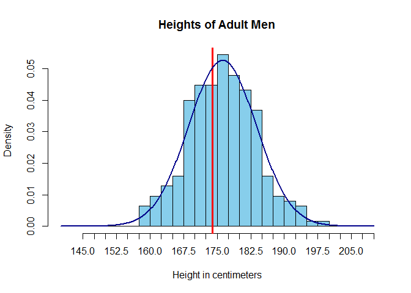

# USU STAT 2300 Module 4.1
Camille Fairbourn  

#Module 4, Part 1: Continuous Random Variables

##Continuous Random Variables

As mentioned previously, each time you open a new RStudio session, you need to run the following three commands.


```r
require(mosaic)
require(openintro)
require(MASS)
```

We're going to look at the males data set, a sample of 250 adult men's recorded height in centimeters. This is a subset of the data included with the NHANES package.

First, we read in the dataset.

```r
males<-read.csv("http://www.math.usu.edu/cfairbourn/Stat2300/RStudioFiles/data/males.csv")
```

We'll use the `hist()` function to construct a frequency histogram of the heights

```r
hist(males$height, 
     main = "Heights of Adult Men", #Include a chart title
     xlab = "Height in centimeters", #Change the label for the x-axis
     col = "skyblue", #Change the fill color of the histogram
     breaks = seq(140, 210, 2.5),
     xaxt = 'n') #This leaves the x-axis blank so we can specify the tick marks ourselves.
axis(side = 1, at = seq(145, 210, 2.5)) #This sets the tick marks every 2.5, starting at 140 and ending at 210.
abline(v = 174, col = "red", lwd = 3) #Add in a thick vertical line at x=174
```

<!-- -->

Use the `tally()` function to count the men that have a height less than or equal to 170 cm.

```r
tally(~height <= 174, data = males)
```

```
## height <= 174
##  TRUE FALSE 
##    98   152
```

You can use this information to calculate the proportion of men in the data set that have a height less than or equal to 170 cm.

Construct a **density** histogram of the heights.

```r
hist(males$height, 
     prob = TRUE, #Specify that you want a density histogram
     main = "Heights of Adult Men", #Include a chart title
     xlab = "Height in centimeters", #Change the label for the x-axis
     col = "skyblue", #Change the fill color of the histogram
     breaks = seq(140, 210, 2.5),
     xaxt = 'n') #This leaves the x-axis blank so we can specify the tick marks ourselves.
axis(side = 1, at = seq(145, 210, 2.5)) #This sets the tick marks every 2.5, starting at 140 and ending at 210.
abline(v = 174, col = "red", lwd = 3) #Add in a thick vertical line at x=174
#Add in the normal curve overlay
points(seq(140, 210, length.out=500),
       dnorm(seq(140, 210, length.out=500),
             mean(males$height), sd(males$height)), type="l", col="darkblue", lwd=2)
```

<!-- -->

Calculate the area under the normal curve less than 174.

```r
pnorm(174, mean=mean(males$height), sd=sd(males$height))
```

```
## [1] 0.3852858
```
