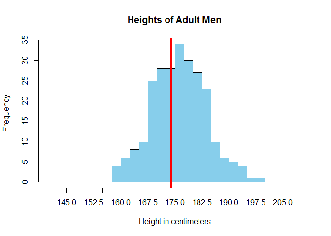

# Camille's R Book
Camille Fairbourn  

#Module 4, Part 1: Continuous Random Variables

##Continuous Random Variables

As mentioned previously, each time you open a new RStudio session, you need to run the following three commands.


```r
require(mosaic)
require(openintro)
require(MASS)
```

We're going to look at the male data set, a sample of 250 adult men's recorded height in centimeters.

First, we read in the dataset.

```r
male<-read.csv("males3.csv")
```

We'll use the `hist()` function to construct a frequency histogram of the heights

```r
hist(male$height, 
     main = "Heights of Adult Men", #Include a chart title
     xlab = "Height in centimeters", #Change the label for the x-axis
     col = "skyblue", #Change the fill color of the histogram
     breaks = seq(140, 210, 2.5),
     xaxt = 'n') #This leaves the x-axis blank so we can specify the tick marks ourselves.
axis(side = 1, at = seq(145, 210, 2.5)) #This sets the tick marks every 2.5, starting at 140 and ending at 210.
abline(v = 175, col = "red", lwd = 3) #Add in a thick vertical line at x=175
```

<!-- -->

Use the `tally()` function to count the men that have a height less than or equal to 175 cm.

```r
tally(~height<=175, data=male)
```

```
## height <= 175
##  TRUE FALSE 
##   109   141
```

Construct a density histogram of the heights.

```r
hist(male$height, 
     prob = TRUE, 
     main = "Heights of Adult Men", #Include a chart title
     xlab = "Height in centimeters", #Change the label for the x-axis
     col = "skyblue", #Change the fill color of the histogram
     breaks = seq(140, 210, 2.5),
     xaxt = 'n') #This leaves the x-axis blank so we can specify the tick marks ourselves.
axis(side = 1, at = seq(145, 210, 2.5)) #This sets the tick marks every 2.5, starting at 140 and ending at 210.
#Add in the normal curve overlay
points(seq(140, 210, length.out=500),
       dnorm(seq(140, 210, length.out=500),
             mean(male$height), sd(male$height)), type="l", col="darkblue", lwd=2)
```

<!-- -->

Calculate the area under the normal curve less than 175

```r
pnorm(175, mean=mean(male$height), sd=sd(male$height))
```

```
## [1] 0.4365238
```
