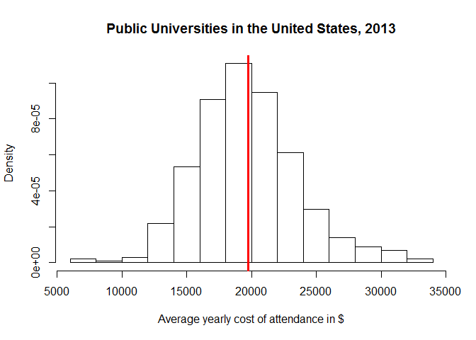
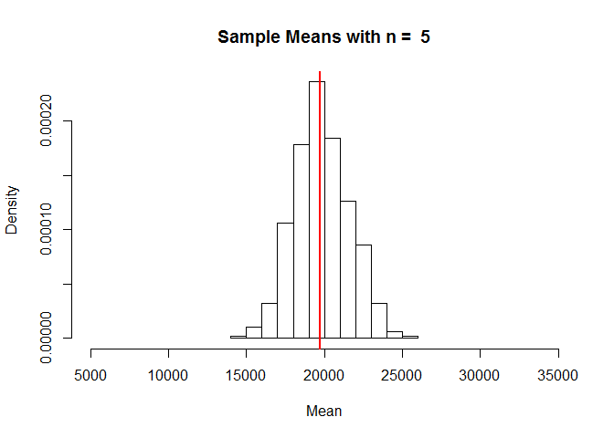
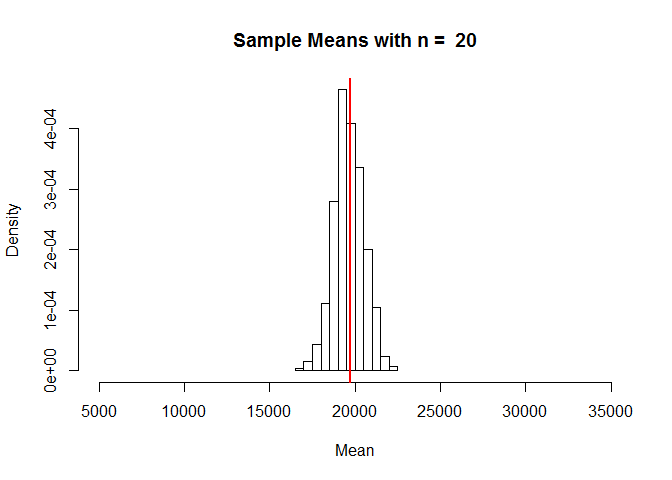
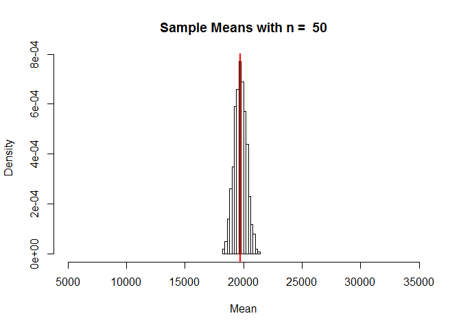

# USU STAT 2300 Module 4.2
Camille Fairbourn  

#Module 4, Part 2: Sampling Distributions

##Sampling Distributions for the Mean

As mentioned previously, each time you open a new RStudio session, you need to run the following three commands.


```r
require(mosaic)
require(openintro)
require(MASS)
```

The U.S. Department of Education hosts a [website](https://collegescorecard.ed.gov/data/) where they make available data about all undergraduate degree-granting institutions of higher education in the United States. In this exercise, we will work with a sample of 506 public universities and their recorded information from the year 2013.

First, we read in the dataset and construct a density histogram of the average yearly cost of attendance. We will also calculate and plot a vertical line at the mean of this variable.

```r
collegecost <- read.csv("http://www.math.usu.edu/cfairbourn/Stat2300/RStudioFiles/data/collegecost.csv")

hist(collegecost$yearly,
     main = "Public Universities in the United States, 2013",
     xlab = "Average yearly cost of attendance in $",
     prob = TRUE)
abline(v = mean(collegecost$yearly), col = "red", lwd = 3)
```

<!-- -->

```r
mean(collegecost$yearly)
```

```
## [1] 19719.76
```

Let's take a simple random sample of 5 of these universities and store the results in a vector called x. We will also calculate the mean for the sample.


```r
x <- sample(collegecost$yearly, 5)
#look at the numbers in this sample and calculate the mean
x #data for this sample
```

```
## [1] 18875 15395 18165 19058 22550
```

```r
mean(x) #this sample mean
```

```
## [1] 18808.6
```

Run the code below 3 more times and make note of the mean of each sample


```r
x <- sample(collegecost$yearly, 5)
x
mean(x)
```

**Increase the sample size to n = 20**

Let's repeat this for a larger sample size. Make note of the mean of each sample.


```r
x <- sample(collegecost$yearly, 20)
x #data for this sample
```

```
##  [1] 16663 13903 19402 13296 13188 15272 16903 15784 29174 15704 20774
## [12] 19900 18227 20819 19303 14906 15612 17380 18781 20796
```

```r
mean(x) #this sample mean
```

```
## [1] 17789.35
```

Run the code below 3 more times and make note of the mean of each sample


```r
x <- sample(collegecost$yearly, 20)
x
mean(x)
```

**Increase the sample size to n = 50**

Repeat once more for an even larger sample size. Again, make a note of the mean of each sample.


```r
x <- sample(collegecost$yearly, 50)
x #data for this sample
```

```
##  [1] 16935 22497 17780 21263 20819 20846 25441 21832 24827 17600 21004
## [12] 18066 16878 17290 20774 18054 23995 13065 28564 23113 16361 21980
## [23] 26086 25255 21420 22046 20371 17805 21498 22633 25665 17892 22926
## [34] 22381 19198 13188 22009 21971 15784 28980 18285 16525 21526 21523
## [45] 12957 26717 33208 23081 18097 18936
```

```r
mean(x) #this sample mean
```

```
## [1] 20938.94
```

Run the code below 3 more times and make note of the mean of each sample


```r
x <- sample(collegecost$yearly, 50)
x
mean(x)
```

**Now we're going to have R take 500 samples of n = 5 universities and record the mean of each sample.**

Specify the sample size, n. Then create a vector to store the sample means and draw the samples.

```r
n <- 5
xbar = rep(0,500)
for(i in 1:500) {xbar[i] = mean(sample(collegecost$yearly, n))}
```

Calculate the mean of the 500 sample means and compare it to the population mean, then create a histogram of the 500 sample means with a line at the population mean.

```r
mean(xbar) #the mean of the sample means
```

```
## [1] 19794.39
```

```r
mean(collegecost$yearly) #the population mean
```

```
## [1] 19719.76
```

```r
hist(xbar, 
     prob = TRUE, 
     breaks = 12, 
     xlim = c(5000, 35000),
     main = "Sample Means",
     xlab = "Mean")
legend("topright",c("n = ",n))
abline(v = mean(collegecost$yearly), col = "red", lwd = 2)
```

<!-- -->

Compare the sample means histogram to the data histogram. What do they have in common? How are they different?

**Let's change the sample size to n = 20 and repeat.**

```r
n<-20
xbar = rep(0,500)
for(i in 1:500) {xbar[i] = mean(sample(collegecost$yearly, n))}

mean(xbar) #the mean of the sample means
```

```
## [1] 19649.12
```

```r
mean(collegecost$yearly) #the population mean
```

```
## [1] 19719.76
```

```r
hist(xbar, 
     prob = TRUE, 
     breaks = 12, 
     xlim = c(5000, 35000),
     main = "Sample Means",
     xlab = "Mean")
legend("topright",c("n = ",n))
abline(v = mean(collegecost$yearly), col = "red", lwd = 2)
```

<!-- -->

**Finally, let's change the sample size to n = 50 and repeat one last time.**

```r
n <- 50
xbar = rep(0,500)
for(i in 1:500) {xbar[i] = mean(sample(collegecost$yearly, n))}

mean(xbar) #the mean of the sample means
```

```
## [1] 19748.83
```

```r
mean(collegecost$yearly) #the population mean
```

```
## [1] 19719.76
```

```r
hist(xbar, 
     prob = TRUE, 
     breaks = 12, 
     xlim = c(5000, 35000),
     main = "Sample Means",
     xlab = "Mean")
legend("topright",c("n = ",n))
abline(v = mean(collegecost$yearly), col = "red", lwd = 2)
```

<!-- -->
