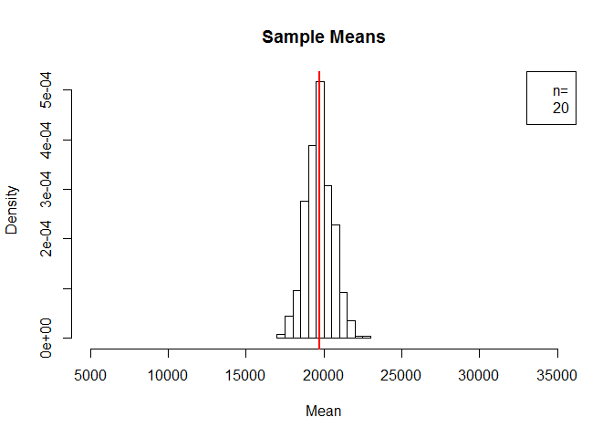

# USU STAT 2300 Module 4.2
Camille Fairbourn  

#Module 4, Part 2: Sampling Distributions

##Sampling Distributions for the Mean

As mentioned previously, each time you open a new RStudio session, you need to run the following three commands.


```r
require(mosaic)
require(openintro)
require(MASS)
```

The U.S. Department of Education hosts a [website](https://collegescorecard.ed.gov/data/) where they make available data about all undergraduate degree-granting institutions of higher education in the United States. In this exercise, we will work with a sample of 506 public universities and their recorded information from the year 2013.

First, we read in the dataset and construct a density histogram of the average yearly cost of attendance. We will also calculate and plot a vertical line at the mean of this variable.

```r
collegecost <- read.csv("http://www.math.usu.edu/cfairbourn/Stat2300/RStudioFiles/data/collegecost.csv")

hist(collegecost$yearly,
     main = "Public Universities in the United States, 2013",
     xlab = "Average yearly cost of attendance in $",
     prob = TRUE)
abline(v = mean(collegecost$yearly), col = "red", lwd = 3)
```

<!-- -->

```r
mean(collegecost$yearly)
```

```
## [1] 19719.76
```

Let's take a simple random sample of 5 of these universities and store the results in a vector called x. We will also calculate the mean for the sample.


```r
x <- sample(collegecost$yearly, 5)
#look at the numbers in this sample and calculate the mean
x #data for this sample
```

```
## [1] 15342 22420 14906 20404 20601
```

```r
mean(x) #this sample mean
```

```
## [1] 18734.6
```

Run the code below 3 more times and make note of the mean of each sample


```r
x <- sample(collegecost$yearly, 5)
x
mean(x)
```

**Increase the sample size to n = 20**

Let's repeat this for a larger sample size. Make note of the mean of each sample.


```r
x <- sample(collegecost$yearly, 20)
x #data for this sample
```

```
##  [1] 14041 30637 17742 16434 17290 28980 21385 18085 24614 18077 15218
## [12] 18822 17125 22796 18165 14034 16663 17440 19212 18158
```

```r
mean(x) #this sample mean
```

```
## [1] 19245.9
```

Run the code below 3 more times and make note of the mean of each sample


```r
x <- sample(collegecost$yearly, 20)
x
mean(x)
```

**Increase the sample size to n = 50**

Repeat once more for an even larger sample size. Again, make a note of the mean of each sample.


```r
x <- sample(collegecost$yearly, 50)
x #data for this sample
```

```
##  [1] 23113 19990 19117 14764 20899 21990 19402 20958 15207 20025 17759
## [12] 22570 15531 23905 18781 17782 17093 21960 21526 19145 21823 14041
## [23] 25799 16107  7715 16556 20282 17377 25384 15218 18387 17873 18547
## [34] 21004 24997 23043 13531 20676 21513 24835 13967 13222 17780 16605
## [45] 18085 22771 31474 16877 32715 15334
```

```r
mean(x) #this sample mean
```

```
## [1] 19501.1
```

Run the code below 3 more times and make note of the mean of each sample


```r
x <- sample(collegecost$yearly, 50)
x
mean(x)
```

Now we're going to have R take 500 samples of n=5 universities and record the mean of each sample.

Specify the sample size, n

```r
n <- 5
#Create a vector to store the sample means and draw the samples
xbar = rep(0,500)
for(i in 1:500) {xbar[i] = mean(sample(collegecost$yearly, n))}

#Calculate the mean of the 500 sample means and compare it to 
#the population mean
mean(xbar) #the mean of the sample means
```

```
## [1] 19811.54
```

```r
mean(collegecost$yearly) #the population mean
```

```
## [1] 19719.76
```

```r
#Create a histogram of the 500 sample means 
#with a line at the population mean
hist(xbar, 
     prob = TRUE, 
     breaks=12, 
     xlim = c(5000, 35000),
     main="Sample Means",
     xlab="Mean")
legend("topright",c("n=",n))
abline(v=mean(collegecost$yearly), col="red", lwd=2)
```

<!-- -->

```r
#Compare the sample means histogram to the data histogram. 
#What do they have in common? How are they different?

#Let's change the sample size to n=20 and repeat.
n<-20
#Create a vector to store the sample means and draw the samples
xbar=rep(0,500)
for(i in 1:500) {xbar[i]=mean(sample(collegecost$yearly, n))}

#Calculate the mean of the 500 sample means and compare it to 
#the population mean
mean(xbar) #the mean of the sample means
```

```
## [1] 19733.53
```

```r
mean(collegecost$yearly) #the population mean
```

```
## [1] 19719.76
```

```r
#Create a histogram of the 500 sample means 
#with a line at the population mean
hist(xbar, 
     prob = TRUE, 
     breaks=12, 
     xlim = c(5000, 35000),
     main="Sample Means",
     xlab="Mean")
legend("topright",c("n=",n))
abline(v=mean(collegecost$yearly), col="red", lwd=2)
```

<!-- -->

```r
#Now change the sample size to n=50 and repeat.
n<-50
#Create a vector to store the sample means and draw the samples
xbar=rep(0,500)
for(i in 1:500) {xbar[i]=mean(sample(collegecost$yearly, n))}

#Calculate the mean of the 500 sample means and compare it to 
#the population mean
mean(xbar) #the mean of the sample means
```

```
## [1] 19714.87
```

```r
mean(collegecost$yearly) #the population mean
```

```
## [1] 19719.76
```

```r
#Create a histogram of the 500 sample means 
#with a line at the population mean
hist(xbar, 
     prob = TRUE, 
     breaks=12, 
     xlim = c(5000, 35000),
     main="Sample Means",
     xlab="Mean")
legend("topright",c("n=",n))
abline(v=mean(collegecost$yearly), col="red", lwd=2)
```

<!-- -->
