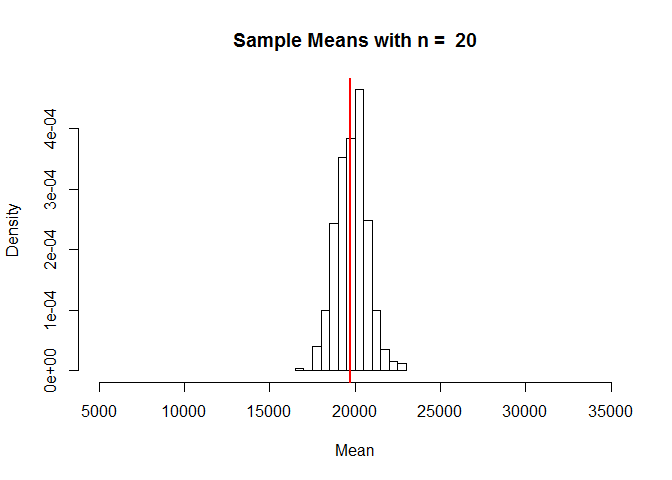

# USU STAT 2300 Module 4.2
Camille Fairbourn  

#Module 4, Part 2: Sampling Distributions

##Sampling Distributions for the Mean

As mentioned previously, each time you open a new RStudio session, you need to run the following three commands.


```r
require(mosaic)
require(openintro)
require(MASS)
```

The U.S. Department of Education hosts a [website](https://collegescorecard.ed.gov/data/) where they make available data about all undergraduate degree-granting institutions of higher education in the United States. In this exercise, we will work with a sample of 506 public universities and their recorded information from the year 2013.

First, we read in the dataset and construct a density histogram of the average yearly cost of attendance. We will also calculate and plot a vertical line at the mean of this variable.

```r
collegecost <- read.csv("http://www.math.usu.edu/cfairbourn/Stat2300/RStudioFiles/data/collegecost.csv")

datamean <- round(mean(collegecost$yearly), 2)
datamean
```

```
## [1] 19719.76
```

```r
hist(collegecost$yearly,
     main = "Public Universities in the United States, 2013",
     xlab = "Average yearly cost of attendance in $",
     prob = TRUE)
abline(v = datamean, col = "red", lwd = 3)
```

<!-- -->

Let's take a simple random sample of 5 of these universities and store the results in a vector called x. We will also calculate the mean for the sample. Notice that if you run the same code on your computer, you will not get the same answer as is shown here. This is because R draws a new sample of 5 colleges each time you run the command.


```r
x <- sample(collegecost$yearly, 5)
#look at the numbers in this sample and calculate the mean
x #data for this sample
```

```
## [1] 20330 17742 17576 15611 21862
```

```r
mean(x) #this sample mean
```

```
## [1] 18624.2
```

Run the code below 3 more times and make note of the mean of each sample. Then calculate the average of your sample means and compare the result to the true mean of 1.971976\times 10^{4}. 


```r
x <- sample(collegecost$yearly, 5)
x
mean(x)
```

**Increase the sample size to n = 20**

Let's repeat this for a larger sample size. Make note of the mean of each sample.


```r
x <- sample(collegecost$yearly, 20)
x #data for this sample
```

```
##  [1] 20422 18809 20799 17478 14034 14710 13735 18837 17290 27759 18936
## [12] 18466 23685 20269 15414 22461 23124 19831 15272 17125
```

```r
mean(x) #this sample mean
```

```
## [1] 18922.8
```

Run the code below 3 more times and make note of the mean of each sample. Then calculate the average of your sample means and compare the result to the true mean of 1.971976\times 10^{4}. 


```r
x <- sample(collegecost$yearly, 20)
x
mean(x)
```

**Increase the sample size to n = 50**

Repeat once more for an even larger sample size. Again, make a note of the mean of each sample. 


```r
x <- sample(collegecost$yearly, 50)
x #data for this sample
```

```
##  [1] 20762 21823 17487 21222 18822 16663 13735 14292 16071 19446 15612
## [12] 20881 22420 19917 20774 22550 22926 15121 18077 19829 15272 17576
## [23] 20025 22974 22771 16361 19571 20478 20282 21990 25416 23740 21980
## [34] 24375 15002 19202 17896 23905 19831 10889 14478 18875 13676 12957
## [45] 20075 24234 18837 22273 19549 21433
```

```r
mean(x) #this sample mean
```

```
## [1] 19287.06
```

Run the code below 3 more times and make note of the mean of each sample. Once more, calculate the average of your sample means and compare the result to the true mean of 1.971976\times 10^{4}. 


```r
x <- sample(collegecost$yearly, 50)
x
mean(x)
```

##Increase the number of samples!

**Now we're going to have R take 500 samples of n = 5 universities and record the mean of each sample.**

Specify the sample size, n. Then create a vector to store the sample means and draw the samples.

```r
n <- 5
xbar = rep(0,500) #This creates a vector of 500 0s.
for(i in 1:500) {xbar[i] = mean(sample(collegecost$yearly, n))}
```

Calculate the mean of the 500 sample means and compare it to the population mean, then create a histogram of the 500 sample means with a line at the population mean.

```r
mean(xbar) #the mean of the sample means
```

```
## [1] 19806.06
```

```r
mean(collegecost$yearly) #the population mean
```

```
## [1] 19719.76
```

```r
hist(xbar, 
     prob = TRUE, 
     breaks = 12, 
     xlim = c(5000, 35000),
     main = paste("Sample Means with n = ", n),
     xlab = "Mean")
abline(v = datamean, col = "red", lwd = 2)
```

<!-- -->

Compare the sample means histogram to the data histogram. What do they have in common? How are they different?

**Let's change the sample size to n = 20 and repeat.**

```r
n<-20
xbar = rep(0,500)
for(i in 1:500) {xbar[i] = mean(sample(collegecost$yearly, n))}

mean(xbar) #the mean of the sample means
```

```
## [1] 19659.84
```

```r
mean(collegecost$yearly) #the population mean
```

```
## [1] 19719.76
```

```r
hist(xbar, 
     prob = TRUE, 
     breaks = 12, 
     xlim = c(5000, 35000),
     main = paste("Sample Means with n = ", n),
     xlab = "Mean")
abline(v = datamean, col = "red", lwd = 2)
```

<!-- -->

**Finally, let's change the sample size to n = 50 and repeat one last time.**

```r
n <- 50
xbar = rep(0,500)
for(i in 1:500) {xbar[i] = mean(sample(collegecost$yearly, n))}

mean(xbar) #the mean of the sample means
```

```
## [1] 19714.03
```

```r
mean(collegecost$yearly) #the population mean
```

```
## [1] 19719.76
```

```r
hist(xbar, 
     prob = TRUE, 
     breaks = 12, 
     xlim = c(5000, 35000),
     main = paste("Sample Means with n = ", n),
     xlab = "Mean")
abline(v = datamean, col = "red", lwd = 2)
```

<!-- -->
